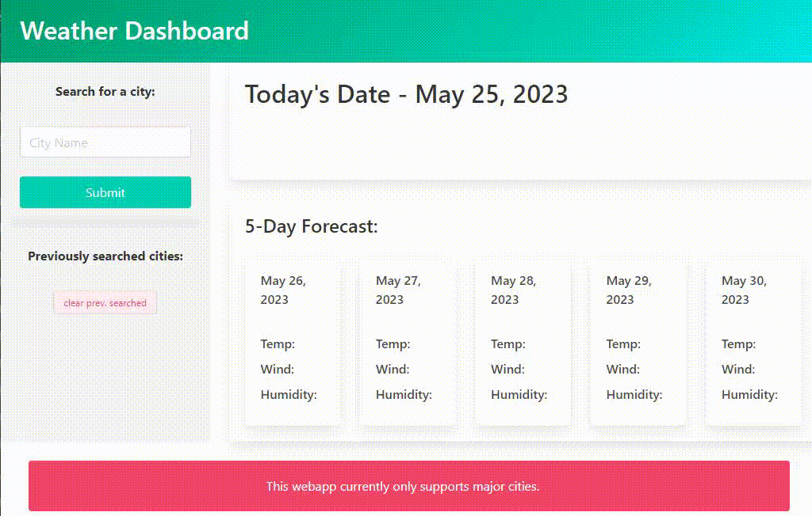

# Weather Dashboard

---

## Description

This webapp utilizes multiple [openweathermap.org](https://openweathermap.org/) APIs to populate a page with thecurrent and future weather based on what city you search. Currently it only supports large cities.

I wanted to get more practice with jQuery, even though it's effectively deprecated, as I know I'll see it in the future so getting some practice with the syntax now could go a long way later on. I also wanted to get some good practice using third party/server side APIs and this was a great project to do that with.

All in all it was a great learning experience and forced me to write the JavaScript in a much more modular way than I have previously.

---

## Installation

N/A

---

## Usage

GitHub Repo (you are here): [Click me!](https://github.com/t-willis/weather-dashboard/)

Deployed Application: [Click me!](https://t-willis.github.io/weather-dashboard/)

---

To use this webapp all you have to do is type the name of a city you wish to retrieve the current weather and five day forecast for in the input field and click 'Submit'. If the input is valid the app will populate the fields on the page with the corresponding data.

Clicking the 'Submit' button will also add an additional button under the 'Previously searched cities:' text, allowing you to simply click on it and repopulate the page with the weather for that city. This allows you to freely search multiple cities without having to type the name more than once. On top of that I utilized localStorage to repopulate the 'Previously searched cities:' field upon revisiting the webapp.

I've also added a 'clear prev. searched' button at the bottom of the 'Previously searched cities:' column that will allow you to clear out all of the localStorage and 'live' data and refresh the page back to its original state.

---

## Known Bugs

* When you search the same city twice it will add multiple buttons of the same name to the 'Previously searched cities:' column.

* If the city you search doesn't exist (typo or something of the like) there will still be a button added under 'Previously searched cities:'. It will, however, not be stored in localStorage. Therefore on page reload it will not be present.

---
## Credits

Get direction from degrees - [Stack Overflow](https://stackoverflow.com/questions/48750528/get-direction-from-degrees)

---